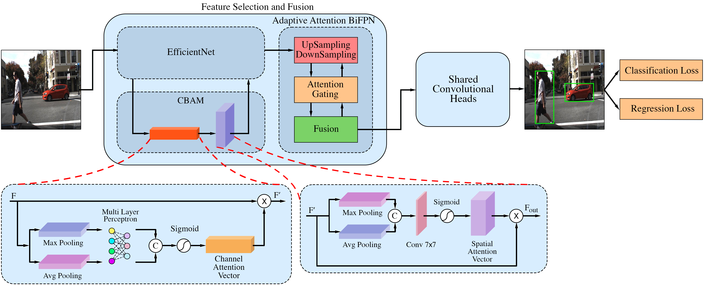
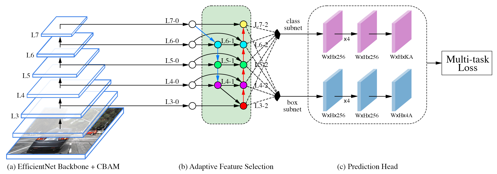
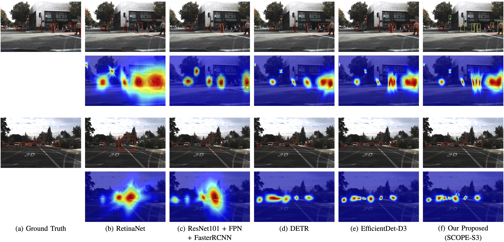
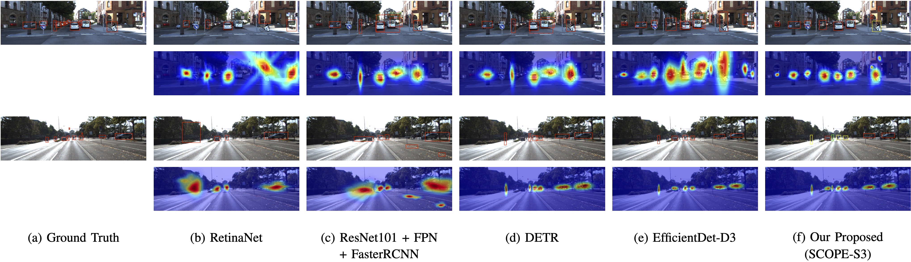
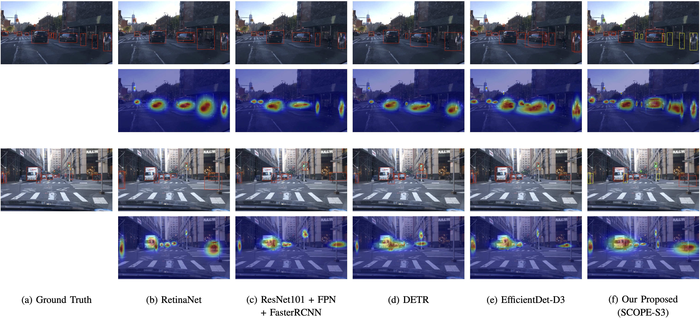
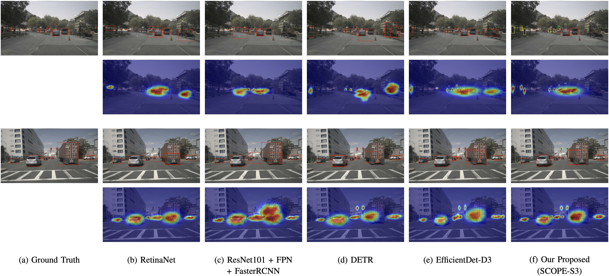

# SCOPE

[]()
[](#framework-overview)
[](#datasets)
[]()
[]()
[](#citation)


Official repository of:

**SCOPE: Spatial-Channel Optimization with Efficient Adaptive Fusion for Real-Time Object Detection in Autonomous Vehicles**

### Authors

Iman Iraei, M. Omair Ahmad, and M. N. S. Swamy


## 🔥 Teaser

<p align="center">
  
</p>

<p align="center">
SCOPE achieves state-of-the-art accuracy while reducing computational complexity and inference latency across multiple autonomous driving datasets.
</p>


## Abstract

Reliable object detection is a critical component of
perception systems in autonomous driving, where recognizing
objects and understanding complex scenes are essential for safety
and decision-making. Among existing detectors, EfficientDet
offers a promising trade-off between accuracy and efficiency
through its compound scaling and Bi-directional Feature Pyramid
Network (BiFPN). However, its performance is hindered by three
key challenges: (1) loss of fine-grained spatial details due to backbone
downsampling, (2) limited contextual awareness resulting
from suboptimal feature fusion in BiFPN layers, and (3) increased
inference latency caused by stacking multiple BiFPN modules.
Unlike conventional BiFPN architectures that rely on static multiscale
fusion, autonomous driving scenes require adaptive feature
selection mechanisms capable of handling severe scale variation
and real-time latency constraints. To overcome these limitations,
we propose a latency-aware adaptive attention fusion framework,
referred to as SCOPE, designed for real-time autonomous
driving perception. SCOPE enhances the EfficientNet backbone
through spatial and channel attention refinement within the
MBConv blocks, while adaptive channel-wise feature weighting
is utilized in a novel efficient attention-guided feature fusion
strategy to improve multi-scale representation quality and fusion
efficiency. The proposed single-layer adaptive attention fusion
method dynamically prioritizes informative multi-scale features
while reducing redundant feature propagation and computational
overhead. Extensive experiments on multiple autonomous driving
datasets demonstrate that SCOPE improves detection accuracy,
while simultaneously reducing computational complexity and
inference latency, thereby outperforming state-of-the-art object
detection methods in terms of both detection performance and
computational efficiency.


## Framework Overview

The overall architecture of SCOPE is illustrated below.

<p align="center">
  
</p>


## Key Contributions

- CBAM-enhanced EfficientNet backbone for improved spatial and channel feature representation.
- Adaptive Attention BiFPN for efficient multi-scale feature fusion.
- Reduced inference latency through lightweight adaptive fusion.
- Improved detection performance for distant and occluded objects.
- Real-time deployment capability for autonomous driving systems.


## 📂 Datasets

Public datasets used in our study:

- [Udacity Self-Driving Car Dataset](https://public.roboflow.com/object-detection/self-driving-car)
- [KITTI Object Detection Benchmark](https://www.cvlibs.net/datasets/kitti/eval_object.php)
- [BDD100K Dataset](https://www.vis.xyz/bdd100k/)
- [nuScenes Dataset](https://www.nuscenes.org/download)


## 🚀 Code and Models

The official implementation of SCOPE will be released in this repository after the peer-review process.

The repository will include:

- Training scripts
- Evaluation scripts
- Dataset preparation tools
- Pretrained checkpoints
- Configuration files


## 🚀 Code and Models

The official implementation will be released upon acceptance of the paper.

### Source Code
- 🚧 Code release coming soon.

### Google Colab Demo
Coming soon.

[]()

The Colab notebook will provide a quick demonstration of inference using the pretrained SCOPE models.

### Repository Contents
- Training scripts
- Evaluation scripts
- Dataset preparation tools
- Pretrained checkpoints
- Configuration files


## Repository Structure

```text
SCOPE/
│
├── assets/
├── configs/
│   ├── scope_s0.yaml
│   ├── scope_s1.yaml
│   └── ...
│
├── models/
│   ├── efficientnet.py
│   ├── cbam.py
│   ├── adaptive_bifpn.py
│   ├── heads.py
│   └── scope.py
│
├── datasets/
│   ├── udacity.py
│   ├── kitti.py
│   ├── bdd100k.py
│   ├── nuscenes.py
│   └── transforms.py
│
├── scripts/
│   ├── train.py
│   ├── test.py
│   ├── eval.py
│   └── inference.py
│
├── utils/
│   ├── losses.py
│   ├── metrics.py
│   ├── visualization.py
│   └── gradcam.py
│
├── README.md
├── requirements.txt
└── LICENSE
```

> **Note:** The above repository structure represents the planned organization of the official implementation. The complete source code will be released upon acceptance of the paper.

---


## 📊 Experimental Results

### Udacity Dataset

<p align="center">
  
</p>

<p align="center">
Performance evaluation and Grad-CAM visualization on the Udacity Self-Driving Car dataset.
</p>

## Quantitative Evaluation Across Model Scales on Udacity

| Model | Scale | Input Res. | BiFPN Channels | BiFPN Layers | Box/Class Layers | mAP@0.5 | mAP@0.75 | mAP | Params (M) | FLOPs (B) | Latency (s) |
|---------|---------|---------|---------|---------|---------|---------|---------|---------|---------|---------|---------|
| EfficientDet | 0 | 512 | 64 | 3 | 3 | 66.41 | 54.15 | 52.32 | 3.94 | 2.55 | 0.0810 |
| **SCOPE** | 0 | 512 | 64 | 1 | 3 | **68.32** | **56.22** | **54.41** | **3.16** | **1.91** | **0.0782** |
| EfficientDet | 1 | 640 | 88 | 4 | 3 | 72.15 | 58.09 | 56.19 | 4.31 | 4.88 | 0.0868 |
| **SCOPE** | 1 | 640 | 88 | 1 | 3 | **73.60** | **59.59** | **57.78** | **3.57** | **4.12** | **0.0813** |
| EfficientDet | 2 | 768 | 112 | 5 | 3 | 75.88 | 60.62 | 58.65 | 4.98 | 9.61 | 0.0943 |
| **SCOPE** | 2 | 768 | 112 | 1 | 3 | **76.86** | **61.62** | **59.89** | **4.29** | **8.62** | **0.0856** |
| EfficientDet | 3 | 896 | 160 | 6 | 4 | 78.32 | 62.27 | 60.42 | 6.42 | 19.22 | 0.1042 |
| **SCOPE** | 3 | 896 | 160 | 1 | 4 | **79.00** | **62.96** | **61.05** | **5.94** | **17.75** | **0.0913** |
| EfficientDet | 4 | 1024 | 224 | 7 | 4 | 79.91 | 63.33 | 61.45 | 9.25 | 38.72 | 0.1171 |
| **SCOPE** | 4 | 1024 | 224 | 1 | 4 | **80.41** | **63.83** | **62.01** | **8.96** | **36.27** | **0.0987** |
| EfficientDet | 5 | 1280 | 288 | 7 | 4 | 80.95 | 63.99 | 62.11 | 16.71 | 88.30 | 0.1340 |
| **SCOPE** | 5 | 1280 | 288 | 1 | 4 | **81.14** | **64.19** | **62.49** | **16.62** | **81.89** | **0.1081** |
| EfficientDet | 6 | 1280 | 384 | 8 | 5 | 81.62 | 64.41 | 62.66 | 29.86 | 178.67 | 0.1661 |
| **SCOPE** | 6 | 1280 | 384 | 1 | 5 | **81.68** | **64.47** | **62.71** | **27.44** | **145.24** | **0.1217** |
| EfficientDet | 7 | 1536 | 384 | 8 | 5 | **82.04** | **64.78** | **63.09** | 51.11 | 321.82 | 0.1850 |
| **SCOPE** | 7 | 1536 | 384 | 1 | 5 | 81.97 | 64.68 | 62.98 | **46.51** | **258.25** | **0.1382** |


### KITTI Dataset

<p align="center">
  
</p>

<p align="center">
Performance evaluation and Grad-CAM visualization on the KITTI benchmark.
</p>

---

### BDD100K Dataset

<p align="center">
  
</p>

<p align="center">
Performance evaluation and Grad-CAM visualization on the BDD100K dataset.
</p>

---

### nuScenes Dataset

<p align="center">
  
</p>

<p align="center">
Performance evaluation and Grad-CAM visualization on the nuScenes dataset.
</p>


## Status

🚧 ## Code Availability

The official implementation of SCOPE will be released in this repository after the peer-review process.


## Citation

```bibtex
@article{iraei2026scope,
  title={SCOPE: Spatial-Channel Optimization with Efficient Adaptive Fusion for Real-Time Object Detection in Autonomous Vehicles},
  author={Iraei, Iman and Ahmad, M. Omair and Swamy, M. N. S.},
  journal={Submitted to IEEE Transactions on Intelligent Transportation Systems (T-ITS)},
  year={2026}
}
```
